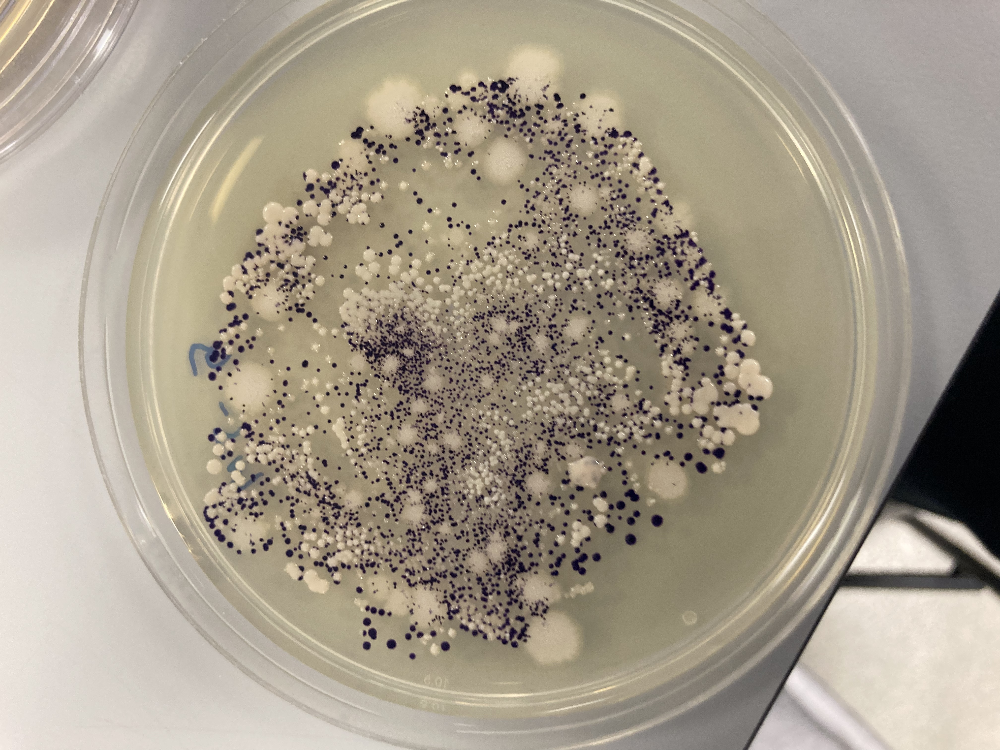

---
---
---

```{r setup, include=FALSE}
knitr::opts_chunk$set(echo = TRUE)

# Hidden Libraries
library(knitr)  # For figures, tables and matricies
library(kableExtra)  # For kable matrix
library(pander)  # For more complex matricies symbol 
library(rmarkdown)
library(tidyverse)
```

# Fundamentals of Data Science Assessment Sheet {.underline}

#### *Matt Prill*

##### Using mixture of typeset and images of workings out

## See 'R Markdown and Literate programming pdf

<https://ele.exeter.ac.uk/pluginfile.php/4501313/mod_resource/content/3/docs/index.html>

## See also Rmarkdown cheatsheet

<https://raw.githubusercontent.com/rstudio/cheatsheets/main/rmarkdown.pdf>

#### Typeset Example: Spearmans rmarkdown

$$\ r_s = 1 -\left(\frac{6\sum_{}D^2}{n(n^2-1)}\right)$$

# Images

Note that you must use out.width and out.height to scale external images (fig.height and fig.width won’t work). To see images, must knit file

```{r, echo = FALSE, out.width = "20%"}
library(knitr)


```

echo = FALSE\` parameter added to prevent printing of the R code \# Libraries

```{r libraries, echo = TRUE, message = FALSE, warning = FALSE}
library(ggplot2)  # For Plotting
library(dplyr)  # For data manipulation
```

\
\
\
\

## Q1

## a)

### Intial Equations:

$$
\Large
\begin{aligned}
x + y + z &= 1 \\
x + 2y + 4z &= \eta \\
x + 4y + 10z &= \eta^2
\end{aligned}
$$\

### Initial Coefficient Matrix:

$$
A = 
\Large
\begin{bmatrix}
1 & 1 & 1 \\
1 & 10 & 4 \\
1 & 4 & 10 
\end{bmatrix}
=
\begin{bmatrix}
a & b & c \\
d & e & f \\
g & h & i 
\end{bmatrix}
$$

### Identifying Eigenvalues:

$$
\Large
\begin{bmatrix}
1 - \lambda & 1 & 1 \\
1 & 10 - \lambda & 4 \\
1 & 4 & 10 - \lambda
\end{bmatrix}
$$
